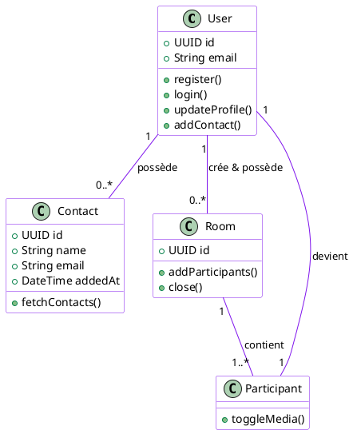

# Architecture du Système : Entités et Interactions Simplifiées �

Ce document détaille les entités fondamentales du projet **Urbania** (V-Sync AI) après simplification, en se concentrant sur le cycle de vie de la réunion et l'identité utilisateur.

---

## 1️⃣ Cartographie des Entités (Core)

Le système est désormais recentré sur 3 entités piliers.

### 👤 User (Utilisateur)
L'entité principale gérant l'identité et l'expérience personnalisée.
*   **Attributs :** id, email, full_name, role, language_preference.
*   **Méthodes :** 
    *   `register()`, `login()`.
    *   `updateProfile()`, `setLanguage()`.
    *   `addContact()` : Ajoute un nouvel utilisateur à son carnet d'adresses.
    *   `createRoom()` : Initialise un nouveau salon.

### 📇 Contact
Représente une relation entre le propriétaire du compte et un autre collaborateur.
*   **Attributs :** id, ownerId, contactName, contactEmail, addedAt.
*   **Méthodes :** 
    *   `fetchContacts()` : Liste tous les contacts de l'utilisateur.
    *   `deleteContact()` : Supprime un contact de la liste.

### � Room (Salon / Salle)
... (reste inchangé)

---

## 2️⃣ Diagramme de Classes UML (Interactions Simplifiées)

---

## 3️⃣ Flux de Travail Utilisateur (Workflow)

1.  **Phase d'Accès :** `register()` -> `login()`.
2.  **Personnalisation :** `setLanguage()` (pour définir la langue de traduction par défaut).
3.  **Lancement :** 
    *   L'utilisateur appelle `createRoom()`.
    *   Il utilise `addParticipants()` ou `addGroups()` pour peupler le salon.
    *   Le système génère les tokens et ouvre l'interface Live.

---

## 4️⃣ Note sur les fonctionnalités retirées
Conformément aux nouvelles spécifications, les entités **Recording** et les méthodes de gestion autonome de **Group** (CRUD Group) ont été retirées pour simplifier le MVP (Produit Minimum Viable) et se concentrer sur l'interaction en temps réel.
