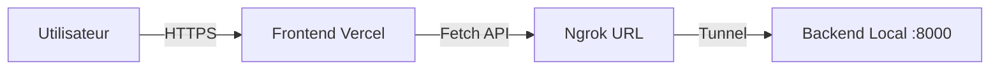

# 📊 Rapport d'Analyse : Problème de Déploiement Vercel & Ngrok

**Date** : 27 Janvier 2026
**Sujet** : Échec de communication Frontend (Vercel) ↔ Backend (Local) via Ngrok

---

## 1. 🏗️ L'Architecture

Pour comprendre le problème, visualisons d'abord l'architecture mise en place :

1.  **Frontend (Client)** : Hébergé sur **Vercel** (Cloud).
2.  **Backend (Serveur)** : Hébergé sur votre **Machine Locale** (Port 8000).
3.  **Le Tunnel (Ngrok)** : Fait le pont entre Internet et votre machine locale.



---

## 2. 🚫 Le Problème (L'Interception Silencieuse)

Lorsque vous tentiez de vous connecter, le Frontend envoyait une requête `POST` pour s'authentifier.
Cependant, la requête échouait de manière étrange, souvent avec une erreur de type *"Unexpected token < in JSON at position 0"* ou simplement une erreur générique.

### Ce qui se passait réellement :

1.  Le **Frontend** envoie : `POST https://xxxx.ngrok-free.app/api/auth/login`
2.  **Ngrok** reçoit la requête.
3.  ⚠️ **Ngrok Détecte** : "C'est une version gratuite et c'est la première fois que ce visiteur vient."
4.  🛑 **Ngrok Intercepte** : Au lieu de transmettre la requête à votre Backend, **Ngrok renvoie une page HTML d'avertissement**.
    *   *Message de la page : "You are about to visit xxxx.ngrok-free.app..."*
5.  Le **Frontend** reçoit cette page HTML (Code 200 OK).
6.  Le **Frontend** essaie de lire la réponse comme du JSON (`response.json()`).
7.  💥 **CRASH** : Le Frontend échoue car il essaie de "parser" du HTML comme si c'était du JSON.

### Visualisation de l'Erreur

```text
Attendu (JSON) :      {"access_token": "xyz", "token_type": "bearer"}
Reçu (HTML Ngrok) :   <!DOCTYPE html><html><body><h1>Visit site...</h1></body></html>
```

---

## 3. 🔍 Pourquoi c'était difficile à voir ?

C'est un problème "vicieux" pour plusieurs raisons :

1.  **Statut HTTP 200** : Ngrok renvoie un code "Succès" (200 OK) pour sa page d'avertissement. Le navigateur ne signale donc pas d'erreur réseau "rouge".
2.  **Invisible en Dev** : Quand vous développez tout en local (`localhost:3000` -> `localhost:8000`), vous ne passez pas par ngrok, donc tout marche.
3.  **Invisible pour le Développeur** : Si vous ouvrez l'URL ngrok dans votre navigateur pour tester, vous cliquez sur "Visit Site" et ngrok enregistre un cookie. Pour vous, le site marche ensuite parfaitement, mais pour vos utilisateurs (ou le code JS du frontend), ça bloque toujours.

---

## 4. ✅ La Solution Technique

Ngrok fournit un mécanisme pour dire "Je suis une API, pas un humain avec un navigateur, laissez-moi passer".

Il faut ajouter un **Header HTTP Spécial** à chaque requête.

### Le Correctif Appliqué :

Nous avons modifié `web/app/lib/api.ts` pour injecter ce header systématiquement :

```typescript
// Avant
headers: {
    'Content-Type': 'application/json'
}

// Après
headers: {
    'Content-Type': 'application/json',
    'ngrok-skip-browser-warning': 'true' // 👈 La clé magique
}
```

### L'Effet du Correctif :

1.  Le **Frontend** envoie la requête avec le header `ngrok-skip-browser-warning`.
2.  **Ngrok** voit le header.
3.  **Ngrok** comprend : "Ah, c'est une application, je ne dois pas afficher la page d'avertissement."
4.  ✅ **Ngrok Laisse Passer** : La requête arrive directement à votre Backend Python.
5.  Le **Backend** répond avec le JSON attendu.

---

## 5. 🎓 Conclusion et Bonnes Pratiques

Ce problème est spécifique à l'utilisation de tunnels "gratuits" pour exposer des environnements locaux.

### Points Clés à Retenir :
*   **Les Tunnels ne sont pas transparents** : Ils peuvent injecter des pages (warnings, erreurs 502, etc.).
*   **Toujours vérifier le Content-Type** : Si votre API attend du JSON mais reçoit du HTML, c'est souvent un proxy ou une page d'erreur intermédiaire.
*   **Headers Personnalisés** : Ils sont puissants pour contrôler le comportement des intermédiaires (comme ici avec ngrok).

Votre déploiement est maintenant robuste et capable de gérer cette spécificité de l'infrastructure de test hybride Cloud/Local.
